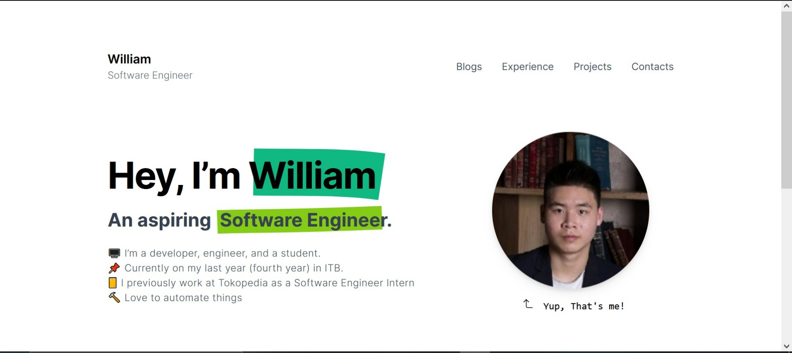

<p align="center">
  <a href="https://github.com/William9923">
    
    <h2 align="center">William</h2>
  </a>
</p> 
<p align="center">An Aspiring <b>Software Engineer</b></p>


  <p align="center">
    
    <a href="https://www.codacy.com?utm_source=github.com&amp;utm_medium=referral&amp;utm_content=william9923/willz-home&amp;utm_campaign=Badge_Grade">
        
    </a>
    
    
  </p>

</img>

>*NOTE: If you are using this site as a template for your own portfolio site, I would be very glad if you add a link to the original site with my name in footer*

## ✨ Contents

- Resume
- Work Experience
- About me
- Education
- Achievement
- Personal Side Projects 
- Contact Me!
- Featured Projects

## 🔨 WIP Features
- [] Automate fetching data from Github (for Projects & Featured Projects)
- [] Blogs

## 📚 Tech Stack

<table>
  <tr>
    <td valign="top">
        
    </td>
    <td valign="top">
        
    </td>
    <td valign="top">
        
    </td>
  </tr>
  <tr>
    <td><p align="center">React Js</p></td>
    <td><p align="center">Next Js</p></td>
    <td><p align="center">Javascript</p></td>
  </tr>
</table>

## 🚀 Quick start

**Run the site locally**

### Step 1: Clone The Repo

Fork the repository. then clone the repo locally by doing -

```bash
git clone https://github.com/William9923/willz-home.git
```

### Step 2: Install Dependencies

cd into the directory
```bash
cd willz-home
```

install all the dependencies
```bash
yarn
```

### Step 3: Start Development Server

Then start the development Server
```
yarn run dev
```
After running the development server the site should be running on https://localhost:3000

## ❤️ Support
If you feel that this repo have helped you provide more example on learning software engineering, then it is enough for me! Wanna contribute more? Please ⭐ this repo so other can see it too!
